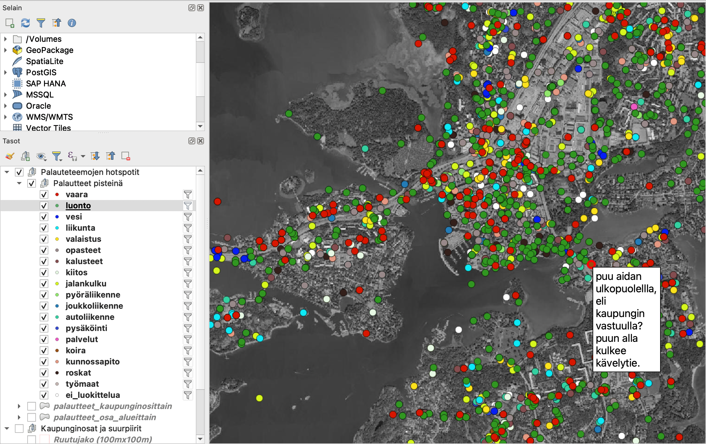

# geospatial-text-analysis
Notebook and QGIS project for visualizing Open311 API data

This notebook reads
- Open311 API data (by default from Helsinki API) or, alternatively,
- Helsinki palautejärjestelmä csv database dump, which contains similar data.

Also the end result is included in this repo. It is a [Geopackage file](./qgis_project_and_layers.gpkg) that contains the data categorized based on Finnish text analysis and [predefined categories](./data/categories.json). QGIS visualization is provided in the same file, so you may just use the result geopackage, if you don't want to tweak the analysis manually.

## Requirements
- Python 3.9
- Docker (for running Elasticsearch with Finnish text analysis, using the excellent [Raudikko library](https://github.com/EvidentSolutions/elasticsearch-analysis-raudikko))

## Setup
1. `pip install -r requirements.txt`
2. `docker build -t analysis_elasticsearch .`
3. `docker run -p 127.0.0.1:9200:9200 -p 127.0.0.1:9300:9300 -e "discovery.type=single-node" analysis_elasticsearch`

Once the Elasticsearch server has started, you may start the notebook by e.g. opening another terminal and

`jupyter notebook 00_data.ipynb`

The notebook should document itself as you move forward.

## Optional input

- If you have access to the database dump, please place the csv files in the [data](./data) directory. If you don't have access to the Helsinki csv database dump, you may run the notebook on all the open data from the last year from the Open311 API instead. 
- If you have access to the Helsinki palautejärjestelmä categories csv file, plase the csv file in the [data](./data) directory. If not, you may run the analysis, just leave out the parts analyzing the service codes, they are not very useful anyway.
- If you wish to adjust the output categories, feel free to edit the [categories.json](./data/categories.json).
- The area names and geometries in [data](./data) directory are open data from Helsinki WFS https://kartta.hel.fi/avoindata/. You may update those files to the latest versions if needed, or, preferably, [make a PR](https://github.com/GispoCoding/geospatial-text-analysis/issues/1) to this repo to read the latest names and geometries automatically from the Helsinki WFS. This data is used for geocoding place names without locations, and doing area statistics on the comments.

## Output

When run through, the notebook will generate
- statistics images on [our categories](./found_categories.png) and the [city service codes](./service_codes.png) found in the data.
- comment layer in the [Geopackage file](./qgis_project_and_layers.gpkg). Each comment contains
    1. all categories the comment belongs to, based on the words in the text,
    2. service codes present in the comment, and
    3. parents of the service codes present in the comment,
    4. all words (and their frequencies) and the most common word found in the comment.
